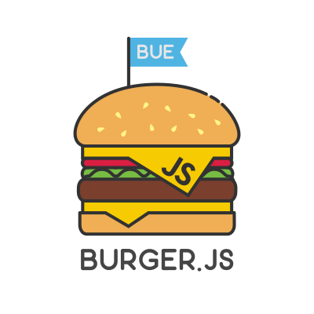

import { CodeSurfer } from 'mdx-deck-code-surfer';
import { Image } from 'mdx-deck';
import TweetEmbed from 'react-tweet-embed';
import Video from './Video';

export { default as theme } from './theme';

# CSS razonable

---

# Cristhian Duran

[@durancristhian](https://twitter.com/durancristhian)

<div style={{ display: 'flex', justifyContent: 'center' }}>
  
  
</div>

---

# Objetivos

- **Cuestionar** como trabajamos con CSS
- Ofrecer una **alternativa** simple, medible y completa

```notes
- Alternativa que veo como un cambio de paradigma

- Herramientas para medir nuestro CSS

- Open mind. No busco que cambies, solo que reflexiones

- Cuantos trabajan con CSS

- Esta charla tiene valor porque...
```

---

<Video id="assets/pescaditos.mp4" />

```notes
- CSS es una tecnología que de repente se va de las manos

- Por eso esta charla creo que tiene valor, para ayudarles a pensar más sobre como trabajamos este aspecto de la web y que tu CSS sea razonable
```

---

<Video id="assets/piñas.mp4" />

```notes
- ¿Son quien golpea o quien recibe golpes?
```

---

# Panorama actual

- La manera de estilizar una interfaz requiere **escribir más y más estilos**

<TweetEmbed id="802328362341384192" />

- CSS es finito
- ¿Cuántas veces **repetimos** las mismas declaraciones?

```notes
- CSS tradicional y CSS-in-JS

- Aunque tenemos la capacidad de crear componentes, inevitablemente tenemos que escribir más y más

- CSS-in-JS trajo mejoras al ecosistema (scoping, especificidad) pero no cambió esta situación

- Cambio de mentalidad: planear vs describir

- Escribimos un conjunto chico de declaraciones una y otra vez en diferentes componentes
```

---

<CodeSurfer
  code={require('!raw-loader!./assets/declaraciones.css')}
  dark={false}
  lang="css"
  showNumbers
  steps={[
    { range: [1, 18] },
    { range: [1, 5], notes: 'Ruleset' },
    { lines: [1, 7, 13], notes: 'Selector' },
    { lines: [2, 3, 4, 8, 9, 10, 14, 15, 16], notes: 'Declaraciones' },
    { lines: [2], notes: 'Declaración' },
    { tokens: { 2: [1] }, notes: 'Propiedad' },
    { tokens: { 2: [3] }, notes: 'Valor' },
    { lines: [7, 9, 13, 14], notes: 'Declaraciones repetidas' },
    { lines: [1, 3, 13, 16], notes: 'Más declaraciones repetidas' },
    {
      lines: [4],
      notes: 'Declaración que no podemos reutilizar'
    }
  ]}
/>

```notes
- Las declaraciones no deberíamos redefinirlas en cada componente

- El cambio de contexto te mata

- Visión imperativa vs declarativa
```

---

# ¿Cuántas veces repetimos las mismas declaraciones?

Lamentablemente, todo el tiempo

```notes
- Esto tiene un impacto directo en muchos aspectos:

    - Performance
    - Mantenimiento (Rulesets largos, context switching)
    - Onboarding (Conocer las clases abstractas)

- Muchos creen que elegir una arquitectura CSS es elegir un framework

- CSS es finito y lo estamos implementando todo el tiempo de nuevo
```

---

# Project Wallace

Dribbble

```bash
npx wallace-cli https://dribbble.com/
```

Basecamp

```bash
npx wallace-cli https://basecamp.com/
```

```notes
- Módulos Open Source

- Pago es el dashboard a lo largo del tiempo
```

---

# CSS Stats

[Dribbble](https://cssstats.com/stats?url=https%3A%2F%2Fdribbble.com&ua=Browser%20Default)

[Basecamp](https://cssstats.com/stats?url=https%3A%2F%2Fbasecamp.com&ua=Browser%20Default)

```notes
- Estos problemas de los que hablamos (y muchos más) dejan en evidencia nuestra falta de una buena arquitectura de estilos
```

---

<Video id="assets/palazos.mp4" />

---

<CodeSurfer
  code={require('!raw-loader!assets/clases-utilitarias.css')}
  dark={false}
  lang="css"
  showNumbers
  steps={[{ range: [1, 16] }]}
/>

```notes
- Todos usamos alguna vez una clase utilitaria al tener elementos que necesitaron variar un poco dado un contexto (Por ejemplo: en mobile un botón que se tiene que mostrar como bloque y con el contenido centrado)
```

---

# Clases utilitarias

- Cumplen **una** función visual específica
- **Inmutables** y **predecibles**
- Fácil usar, agregar, eliminar y razonar

```notes
- Inmutables y predecibles: No están sujetas a ambiguedades. Una clase `.card` si. Nunca se puede saber a ciencia cierta QUE implementa

- Recordando que son muchas las declaraciones repetidas en nuestro código, ¿podríamos construir una interfaz con clases utilitarias?
```

---

# Atomic CSS

```notes
- Arquitectura CSS no opinionada compuesta de un conjunto finito de clases utilitarias encargadas de 1 solo aspecto visual que permiten componer nuevos elementos de interfaz
```

---

# Tachyons

- Arquitectura **no opinionada**
- Filosofía **declarativa** (La responsabilidad ahora está en el template)
- Cada clase cumple **una** función visual específica
- Muy fácil de razonar, extender y personalizar
- Puede convivir con otra solución

```notes
- No dicta COMO se escriben las cosas. Te da las clases para que vos compongas

- CSS deja de ser un actor principal en la creación de componentes. No hay impacto porque idealmente no escribimos más CSS

- Construido con Responsive design en mente

- Aprendés pocas reglas y salís andando. El proyecto está pensado para ser fácil de extender y personalizar. Incluso hay herramientas específicas para hacerlo
```

---

<iframe
  sandbox="allow-modals allow-forms allow-popups allow-scripts allow-same-origin"
  src="https://codesandbox.io/embed/2p996x956j"
  style={{
    border: 0,
    height: '90vh',
    width: '90vw'
  }}
/>

---

# Otros argumentos a favor

- La guía de estilos existe desde el día 1
- Nombrar por función visual es más conveniente que un concepto abstracto
- **15 kb**
- No más cascada, especificidad de selectores y escribir demasiado CSS
- Hay problemas visuales que ahora pueden resolverse directamente en HTML
- Brilla cuando necesitás bajar el peso de tu CSS, refactorizar o hacer convivir 2 implementaciones al mismo tiempo

---

# ¿Desventajas?

- Los nombres parecen chino
- Llenás de clases el HTML

```notes
- Los nombres parecen chino
  - Podés elegir la versión extendida
  - La guía de estilos existe desde el primer día

- Llenás de clases el HTML
  - Estás componiendo, no definiendo
  - Probablemente estés necesitando mejor componentización
```

---

# Comentarios finales

- Estaría buenísimo automatizar la creación de clases en base a los estilos aplicados para desligar la optimización del desarrollo
- Sienta un contrato muy fuerte entre diseño y frontend (Y eso es espectacular)
- Es muy fácil empezar a usarlo. Y también dejarlo
- Es importante ir revisando el CSS que generamos
- Apostá por un enfoque declarativo para tu interfaz

---

<Video id="assets/bailongo.mp4" />

---

# Gracias
